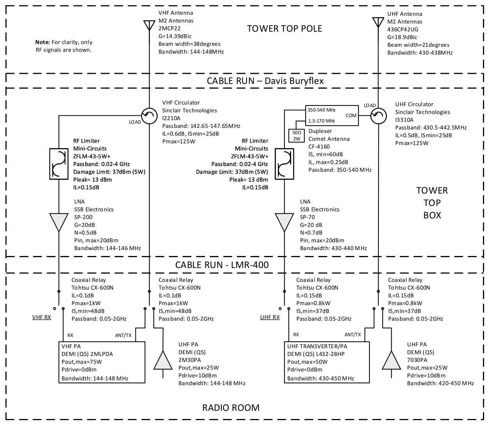

## Overview

The Propagation Laboratory is actively involved in Amateur satellite development, especially student training and open access software and hardware work related to this area. Combining Amateur radio with satellite development is an excellent learning opportunity for engineering students at the University of Victoria. This page captures the information which is required for any Amateur to interact with orbiting satellites which the Propagation Laboratory contributed to. Should there by any missing information, Amateurs are encouraged to [contact us](https://www.propagationlab.ca/contact/) so we can properly amend this page. 

## Satellite Specific Information

### MARMOTSat

#### Mission Overview

[MARMOTSat](https://www.marmotsat.ca) is 3U CubeSat which was launched on July 7, 2026 on SpaceX Transpoter-17. It is formally designated as Canada's first OSCAR mission (CO-128), carrying a Greencub stlye  VHF digipeater, a VHF and a 10m HF CW beacon, a novel DVB-S2 video beacon on 10 m, as well as an ionospheric sounding experiment with a citizen science aspect, also utilizing the 10m band. Amateurs are encouraged to be involved in this mission via participation in the above-mentioned experiments. Information on these will be gradually added to this page as it becomes available during development.

MARMOTSat also uses UHF Amateur spectrum for TT&C, utilzing a subsystem separate from the Amateur payload for reasons of reliability and regulatory compliance. This subsystem is not available for Amateur use in the traditional sense, but the telemetry may be receivable by Amateurs in the Pacific Northwest. The UHF system is only active when the satellite is visible from its dedicated ground station in Victoria.

#### Radio Frequencies

MARMOTSat uses the following frequencies for TT&C and Amateur experiments:

| Amateur Experiment | Frequency |
| :---: | :---: |
| TT&C up- and downlink | 436.125 MHz |
| Digipeater up- and downlink | 145.875 MHz |
| CW telemetry beacon downlink | 145.875 MHz |
| CW telemetry beacon downlink | 29.410 MHz |
| DVB-S2 digital video beacon | 29.410 MHz |
| Linear frequency modulation downlink | 29.410 MHz |

Frequencies in each band are shared. The Amateur experiments are all mutually exclusive and will never be run at the same time. Similarly, TT&C will not be run at the same time as Amateur experiments.

#### Amateur Payload Overview

The Amateur payload is available to be used by all interested and propely licensed parties, gobally. The Amateur payload is the debut of the [Modular CubeSat Radio](https://gitlab.uvic-cfar.com/open-source-projects/mcr), featuring the RF modules necessary to facilitate MARMOTSat’s Amateur radio and ionospheric science experiments. The MCR configuration for this mission is the core consisting of the SDR, computer and camera, as well as HF and VHF RF front ends, and wire antennas:

- HF antenna: Base loaded quater-wave tape measure whip. 
- VHF antenna: Half wave tape measure dipole. 
- Computer: Commercial off the shelf [AMD Kria K24](https://www.amd.com/en/products/system-on-modules/kria/k24.html) system on module (SoM) running custom Linux.
- Radio: Low power, GNU Radio compatible HF SDR based on the [Hermes Lite 2](http://www.hermeslite.com/). Design [here](https://gitlab.uvic-cfar.com/open-source-projects/mcr/-/tree/main/hardware/mcr-core).
- HF RF front end: Two stage QRP HF amplifier for 10m. Design [here](https://gitlab.uvic-cfar.com/open-source-projects/mcr/-/tree/main/hardware/mcr-hf-pa).
- VHF RF front end: HF to VHF transverter. Design [here](https://gitlab.uvic-cfar.com/open-source-projects/mcr/-/tree/main/hardware/mcr-vhf-xvtr).
- Camera: Off the shelf [KissCam V1](https://mvpaerospace.com/products/) serial camera module, from MVP Aerospace.

#### Amateur Experiment Schedule

As of August 2026, the experiment schedule until further notice is the VHF Morse Code beacon, operated at 2W RF power with a text message (CQ DE VA7UVS CO-128 QRO 2 WATTS ANT DIPOLE WWWW.MARMOTSAT.CA) in place of telemetry as electrical power allows. Amateurs are encoruaged to check the [AMSAT Satellite Status Page](https://mvpaerospace.com/products/) for activity on the CO-128_\[TLM\] line and make a report when the beacon is heard. The digipeater and HF experiments are not enabled. Once they are available for use, this section will be updated accordingly.

#### Morse Code Beacon Experiment

##### Overview 

The Morse Code beacons, available on HF and VHF, provide easy to access information about the health of the electronic subsystems on board of the spacecraft, or simple messages for dissemination by humans. The beacon is designed to be received aurally, or via digital aids, such as CW Skimmer, and has a speed of 15 WPM. Transmissions are periodic, and the same message is repeated indefinitely. 

##### HF Equipment Requirements for Amateurs

- Any HF 10 m antenna, designed for space communications. See [here](hhttps://gitlab.uvic-cfar.com/open-source-projects/hf-turnstile-antenna) for a suitable design, a 10m turnstile, prepared as an open-source contribution by the MARMOTSat team.
- HF radio with CW mode, or low-cost HF SDR (e.g. RTL, AirSpy etc.) and Windows/Linux computer with suitable open-source support software, such as [Quisk](http://www.james.ahlstrom.name/quisk/) or [gqrx](https://www.gqrx.dk/). [CW Skimmer](https://www.dxatlas.com/CwSkimmer/) if aural reception is undesired.

##### VHF Equipment Requirements for Amateurs

- Directional VHF antenna, such as a VHF Arrow, or better (M2 LEO Pack, etc.).
- VHF radio with CW mode, or low cost VHF SDR (e.g. RTL, AirSpy etc.) and Windows/Linux computer with suitable open-source support software, such as [Quisk](http://www.james.ahlstrom.name/quisk/) or [gqrx](https://www.gqrx.dk/). [CW Skimmer](https://www.dxatlas.com/CwSkimmer/) if aural reception is undesired.

##### Telemetry Scheme

If the beacon is configured to operate in telemetry mode, this section will be updated. If you are reading this, you can expect human readable text to be transmitted by MARMOTSAT.

#### Digipeater Experiment

##### Overview

The digipeater subsystem is a two-way communication experiment designed to serve the Amateur radio community. It can operate in real time or store and forward mode, and it is designed to operate the same way as the well-known [IO-117 Greencube](https://www.s5lab.space/index.php/digipeater-greencube/), but on VHF.

##### Digipeater Equipment Requirements & Usage

The equipment requirements for Amateurs and the usage are the same as for Greencube. The MARMOTSat digipeater is designed to be compatible with all existing hardware and software what the Amateur community uses for Greencube style digipeater operation. Once the digipeater is enabled, more detailed instructions will be posted here.

#### DVB-S2 Experiment

##### Overview

The DVB-S2 experiment is a way for Amateurs to receive live video from the on-board camera of MARMOTSat, via a DVB-S2 signal, conforming to the [QO-100 operating guidelines](https://amsat-dl.org/en/p4-a-nb-transponder-bandplan-and-operating-guidelines/), transmitted from MARMOTSat on the 10m Amateur satellite allocation. The signal is QPSK, with a roll of factor of 0.35, at 66 or 33 kbaud symbol rate, and a ½ FEC rate. ACM is not used. The experiment was motivated by successful transatlantic DATV transmissions, by [Rob M0DTS](https://ei7gl.blogspot.com/2022/11/successful-digital-amateur-tv-tests-on.html). Please note that this is a very noise sensitive experiment. Only those who meet the definition of Quiet Rural location as defined in [ITU Recommendation P.372-17 (08/2024) Radio Noise](https://www.itu.int/rec/R-REC-P.372-17-202408-I/en) should attempt this experiment, and only for passes above 35 degree elevation.

The video for this experiment is licensed under [CC BY-NC 4.0](https://creativecommons.org/licenses/by-nc/4.0/).

##### Equipment Requirements for Amateurs
- Any HF 10 m antenna, designed for space communications. See [here](hhttps://gitlab.uvic-cfar.com/open-source-projects/hf-turnstile-antenna) for a suitable design, a 10m turnstile, prepared as an open-source contribution by the MARMOTSat team.
- Low-cost HF SDR (e.g. RTL, AirSpy etc.) and Windows/Linux computer with GNU radio. A GNU Radio flowgraph for decoding the video will be provided here by the time the experiment is enabled.

#### Citizen Science Experiment

##### Overview
The citizen science experiment is a way for Amateurs to contribute to the Propagation Laboratory’s ongoing research project regarding the structure and composition of the ionosphere, and the potential correlation between that and natural and human caused terrestrial phenomena, such as earthquakes and climate change. As part of this, a linear frequency modulated waveform, similar to CODAR, is transmitted from MARMOTSat on the 10m Amateur satellite allocation, which Amateurs can pick up, record, and submit to a centralized repository, using only affordable, open source equipment.

##### Equipment Requirements for Amateurs
- Any HF 10 m antenna, designed for space communications. See [here](hhttps://gitlab.uvic-cfar.com/open-source-projects/hf-turnstile-antenna) for a suitable design, a 10m turnstile, prepared as an open-source contribution by the MARMOTSat team.
- Low-cost HF SDR (e.g. RTL, AirSpy etc.) and Windows/Linux computer with GNU radio. 

##### Recording Format & Data Submission
Instructions on the recording format and data submission will be posted here by the time the experiment is enabled.

### ORCASat

[ORCASat](https://www.orcasat.ca/design) was a 2U CubeSat, with a mission of HQP training, and it was the direct predecessor of the MARMOTSat project, under the CSA's Canadian CubeSat Project. ORCASat did not have Amateur radio experiments, but it used the same UHF TT&C scheme as MARMOTSat, and it flight qualified many of its subsystems, including its UHF antenna, which is now available to all as an open source project [here](https://gitlab.orcasat.ca/orcasat-group/orcasat-antenna). This section is maintained for legacy purposes only, as ORCASat has deorbited in July 2023.

### TT&C Information

#### Overview
All the satellites on this page use the same TT&C scheme, based on the [Open LST](https://github.com/OpenLST/openlst) project, and hardware and software originally developed for the ORCASat mission. TT&C operations only take place when prompted by the one dedicated control station in Victoria, BC, Canada, with call VA7UVG. All uplink commands are encrypted, and Amateur radio operators do not have the ability to upload commands to the spacecraft, or prompt it to transmit UHF telemetry on demand. Using the information on this page, however, it is possible to observe, record and decode the downlink traffic between this satellite and the control station.

- Control station: VA7UVG
- Antenna: Half-wave dipole.
- Radio: Heavily customized half duplex UHF transceiver based on Planet’s [Open LST](https://github.com/OpenLST/openlst).
- Emission: Uncoded 2-FSK with PN9 whitening, 10.17 kbps rate, 6.18 kHz deviation (25K0F1DBN).
- Service Area: When above 15 degrees elevation, as observed Victoria, BC.

#### Packet Format
A packet radio scheme is used, with transmission format derived from what is used by the Open LST project, with variable payload length and structure based on the packet format natively supported by the Texas Instruments (TI) CC1110 transceiver. The default TI structure shown in Figure 51 on page 194 of the CC1110 [datasheet](https://www.ti.com/lit/gpn/cc1110-cc1111). Below is an explanation of what features of the default TI structure used, and what are omitted.

- The optional Address byte is not used.
- Variable packet length mode is employed where the Length field gives the length of the Data field (payload) in bytes. When operating with variable length packets, the radio will use the first byte in the packet to determine how many additional bytes it should expect to receive. The length of the variable packet is determined by the first byte in the Payload Message field, which happens to be the Length field of our packet above.
- The PKTLEN register is used to set the maximum packet length allowed in RX.
- The hardware CRC is also not used, instead it is implemented in software in the payload.

When a packet is received, the hardware packet handler will strip the packet down to the Payload Data only. This payload data is the packet with Length, flag and footer fields. This packet is again operated on and made into the original **\| Hardware ID \| Seq_Num \| System \| Command \| Payload Message \|** packet, that the radio command handler will recognize and so will the CDH team.

The resulting RF messaging communication protocol is shown below. Fields marked with “*” are sent LSB first.

| Length | Flag | Seq_Num | System | Command | Payload Message | Hardware ID | Software CRC |
| --- | --- | --- | --- | --- | --- | --- | --- |
| 1 byte | 1 byte | 2 bytes* | 1 byte | 1 byte | N bytes | 2 bytes* | 2 bytes |

## UVic Ground Station Information

The UVic Ground Station is a state-of-the-art multi-mode multi-band Amateur satellite station with HF, VHF and UHF satellite capabilities, as well as traditional terrestrial HF operating capabilities for all bands except 60 and 160m. The station has been carefully designed for a multi-use university environment, and it is designed to facilitate CubeSat telecommand operations on Amateur spectrum, as well as HQP training.

The station is built around a Flex-6600M transceiver for all operation modes except doing CubeSat telecommand, for which an USRP B210 as well as a custom modem based specific to the radio used by UVic’s satellites is available. These is complemented with a collection of high-performance antennas, and supported with commercial grade infrastructure, such as generator backup and redundant methods of Internet access.

The detailed design of the station’s satellite component is shown below, via a diagram which is focused on the RF elements for clarity. The core design principles are the use of modern technologies (SDR, remote operation etc.), antenna sharing between the CubeSat telecommand and Amateur satellite (OSCAR) operating modes, as well as HF antenna and rotator sharing with the other HF station in the Propagation Lab, built around a Elecraft K4 and KPA500, for CW contesting.

If CubeSat telecommand operations is desired, using the SSPA signal chain near the bottom of the diagram, the station computer is booted onto Linux, and the USRP B210 or the custom modem is available to interface with GNU Radio, or UVic’s custom Mission Control Software. A bank of RF relays, rated to handle the necessary power levels, and controlled by an IP relay board allows the operator to route the satellite antennas and RF front end to the radios and amplifiers dedicated to this mode of operation. 

For Amateur satellite (OSCAR) operation, the station is configured by default, via the transverter signal chain near the bottom of the diagram. In this case, the station is booted to Windows, and the Q5 Signal Transverters are automatically routed to the satellite antennas, using the normally connected ports of the RF relays above. This configuration also allows HF operation – for this a 4O3A Antenna and Rotator Genius (not shown) provides access to the lab’s HF antenna farm, which, among other antennas, provides access to a custom designed turnstile antenna for the 10 m satellite allocation.